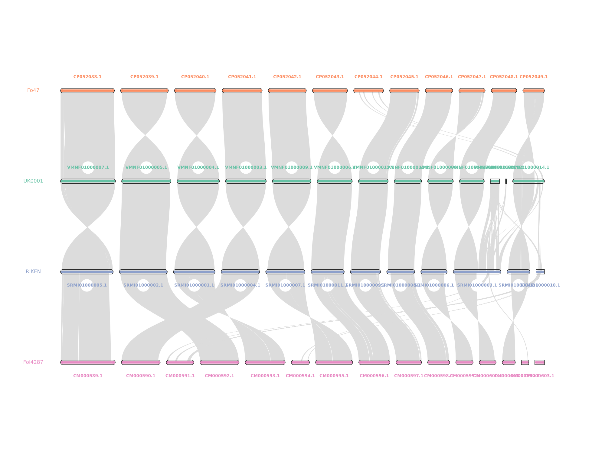

# Generating synteny comparison between _Foc_ TR4 genomes


Here is the code used to generate an overview of the synteny between [our genome assembly](https://doi.org/10.1128/mra.00904-19) of *Fusarium oxysporum* f. sp. *cubense* TR4 versus several relevant reference genome sequence assemblies.
* Warmington RJ, Kay W, Jeffries A, et al. High-Quality Draft Genome Sequence of the Causal Agent of the Current Panama Disease Epidemic. *Microbiol Resour Announc.* 2019;8(36):e00904-19. Published 2019 Sep 5. doi:10.1128/MRA.00904-19 
* Asai S, Ayukawa Y, Gan P, et al. High-Quality Draft Genome Sequence of *Fusarium oxysporum* f. sp. *cubense* Strain 160527, a Causal Agent of Panama Disease. *Microbiol Resour Announc.* 2019;8(29):e00654-19. Published 2019 Jul 18. doi:10.1128/MRA.00654-19
* Wang B, Yu H, Jia Y, et al. Chromosome-Scale Genome Assembly of *Fusarium oxysporum* Strain Fo47, a Fungal Endophyte and Biocontrol Agent. *Mol Plant Microbe Interact* 2020;33(9):1108-1111. doi:10.1094/MPMI-05-20-0116-A
* Ma LJ, van der Does HC, Borkovich KA, et al. Comparative genomics reveals mobile pathogenicity chromosomes in *Fusarium*. *Nature.* 2010;464(7287):367-373. doi:10.1038/nature08850

It uses the MCscan function with the JCVI libraries: 
* https://github.com/tanghaibao/jcvi/wiki/MCscan-(Python-version) 
* Tang et al. (2015). jcvi: JCVI utility libraries. *Zenodo.* 10.5281/zenodo.31631. [](https://doi.org/10.5281/zenodo.31631)

## Download the CDS and GFF files from NCBI:
Note that we can only use genome assemblies for which CDS have been provided. This eliminates most of the chromosome-scale assemblies in NCBI

```
### UK0001 TR4 
wget --no-clobber https://ftp.ncbi.nlm.nih.gov/genomes/all/GCA/007/994/515/GCA_007994515.1_ASM799451v1/GCA_007994515.1_ASM799451v1_cds_from_genomic.fna.gz
wget --no-clobber https://ftp.ncbi.nlm.nih.gov/genomes/all/GCA/007/994/515/GCA_007994515.1_ASM799451v1/GCA_007994515.1_ASM799451v1_genomic.gff.gz

### RIKEN 160527 
wget --no-clobber https://ftp.ncbi.nlm.nih.gov/genomes/all/GCA/005/930/515/GCA_005930515.1_ASM593051v1/GCA_005930515.1_ASM593051v1_cds_from_genomic.fna.gz
wget --no-clobber https://ftp.ncbi.nlm.nih.gov/genomes/all/GCA/005/930/515/GCA_005930515.1_ASM593051v1/GCA_005930515.1_ASM593051v1_genomic.gff.gz

### Fo47 reference sequence
wget --no-clobber https://ftp.ncbi.nlm.nih.gov/genomes/all/GCA/013/085/055/GCA_013085055.1_ASM1308505v1/GCA_013085055.1_ASM1308505v1_cds_from_genomic.fna.gz
wget --no-clobber https://ftp.ncbi.nlm.nih.gov/genomes/all/GCA/013/085/055/GCA_013085055.1_ASM1308505v1/GCA_013085055.1_ASM1308505v1_genomic.gff.gz

### Fol 4287 reference sequence
wget --no-clobber https://ftp.ncbi.nlm.nih.gov/genomes/all/GCF/000/149/955/GCF_000149955.1_ASM14995v2/GCF_000149955.1_ASM14995v2_cds_from_genomic.fna.gz
wget --no-clobber https://ftp.ncbi.nlm.nih.gov/genomes/all/GCA/000/149/955/GCA_000149955.2_ASM14995v2/GCA_000149955.2_ASM14995v2_genomic.gff.gz


gunzip *.fasta.gz *.gff.gz
```
## Generate BED files

```
python -m jcvi.formats.gff bed --type=mRNA --key=locus_tag GCA_007994515.1_ASM799451v1_genomic.gff -o UK0001.bed
python -m jcvi.formats.gff bed --type=mRNA --key=locus_tag GCA_005930515.1_ASM593051v1_genomic.gff -o RIKEN_160527.bed
python -m jcvi.formats.gff bed --type=mRNA --key=locus_tag GCA_013085055.1_ASM1308505v1_genomic.gff -o Fo47.bed
python -m jcvi.formats.gff bed --type=mRNA --key=locus_tag GCA_000149955.2_ASM14995v2_genomic.gff -o Fol4287.bed

```

### Generate properly formatted CDS FastA files
```
perl reformat_fasta_with_locus_tags.pl GCA_007994515.1_ASM799451v1_cds_from_genomic.fna > UK0001.cds
perl reformat_fasta_with_locus_tags.pl GCA_005930515.1_ASM593051v1_cds_from_genomic.fna > RIKEN_160527.cds
perl reformat_fasta_with_locus_tags.pl GCA_013085055.1_ASM1308505v1_cds_from_genomic.fna > Fo47.cds
perl reformat_fasta_with_locus_tags.pl GCF_000149955.1_ASM14995v2_cds_from_genomic.fna > Fol4287.cds

```

### Compare UK0001 against RIKEN_160527
```
python -m jcvi.compara.catalog ortholog RIKEN_160527 UK0001 --no_strip_names 

python -m jcvi.compara.synteny screen --minspan=30 --simple RIKEN_160527.UK0001.anchors RIKEN_160527.UK0001.anchors.new

python -m jcvi.graphics.karyotype seqids layout --keep-chrlabels --font=Arial --figsize=25x15

```

### Compare UK0001 against Fo47
```
python -m jcvi.compara.catalog ortholog Fo47 UK0001 --no_strip_names 

python -m jcvi.compara.synteny screen --minspan=30 --simple Fo47.UK0001.anchors Fo47.UK0001.anchors.new

```

### Compare RIKEN versus Fol4287
```
python -m jcvi.compara.catalog ortholog RIKEN_160527 Fol4287 --no_strip_names 

python -m jcvi.compara.synteny screen --minspan=30 --simple RIKEN_160527.Fol4287.anchors RIKEN_160527.Fol4287.anchors.new

python -m jcvi.graphics.karyotype seqids layout --keep-chrlabels --font=Arial --figsize=25x15


```


### Generate macrosynteny plot

```
python -m jcvi.graphics.karyotype seqids layout --keep-chrlabels --font=Arial --figsize=20x15 --nocircles -o karyotype-no-labels.pdf

python -m jcvi.graphics.karyotype seqids layout --keep-chrlabels --font=Arial --figsize=20x15  -o karyotype-with-labels.pdf

```
